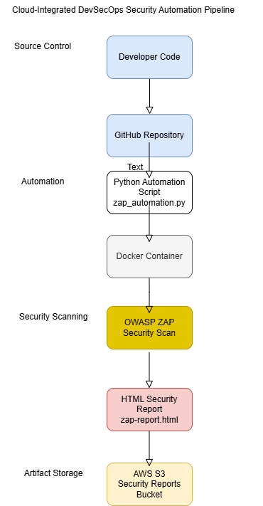

# Cloud-Integrated DevSecOps Security Automation Pipeline

## Overview

This project demonstrates a cloud-integrated DevSecOps security automation pipeline using:

- Python
- OWASP ZAP (Docker)
- Flask test application
- AWS S3 for report storage
- Automated HTML report generation
- Timestamped cloud uploads for traceability

The pipeline simulates a real-world DevSecOps workflow where security testing is automated and security artifacts are centrally stored in cloud infrastructure.

---
## Architecture

1. Flask application runs locally
2. OWASP ZAP runs via Docker
3. Python automation script triggers security scan
4. HTML security report generated
5. Report uploaded to AWS S3
6. Reports organized by timestamp

---

## Technology Stack

- Python 3.13 (Security automation orchestration)
- OWASP ZAP (Dynamic Application Security Testing - DAST)
- Docker (Containerized security scanning)
- Flask (Sample web application target)
- AWS S3 (Security report artifact storage)
- AWS CLI (Cloud authentication and configuration)
- boto3 (Python AWS SDK for automated uploads)
- Git / GitHub (Version control and repository management)
- VS Code (Development environment)

---

## Project Structure

app/
Flask test application

automation/
Python security automation scripts

docs/
Architecture diagrams

requirements.txt
Python dependencies

---

## How It Works

1. Start Docker
2. Launch Flask app
3. Execute automation script
4. Generate ZAP security report
5. Automatically upload report to AWS S3 bucket

---

## Security Workflow

1. Developer pushes code to GitHub
2. Python automation script triggers security scan
3. OWASP ZAP performs dynamic security testing
4. HTML report is generated
5. Security artifact uploaded to AWS S3
6. Reports stored with timestamp for auditing and review

---

## Cloud Security Implementation

- IAM user authentication
- Secure AWS credential configuration
- S3 bucket with structured report storage
- Timestamp-based folder organization
- Programmatic S3 uploads using boto3

---

## Sample Output

ZAP scan generates:
- PASS findings
- WARN findings
- HTML report artifact
- Cloud upload confirmation

Example:

---

## Why This Project Matters

This project demonstrates:

- Security automation integration
- Infrastructure + application security alignment
- Cloud-native security artifact management
- DevSecOps workflow orchestration
- Real-world CI/CD security foundation

---

## Future Enhancements

Planned improvements to expand the DevSecOps security pipeline:

- Integrate GitHub Actions CI/CD to automatically run security scans on code commits
- Trigger OWASP ZAP scans automatically on repository push events
- Implement Amazon S3 lifecycle policies for automated report retention and archival
- Add AWS CloudWatch logging for pipeline monitoring and security event visibility
- Provision infrastructure using Terraform for repeatable Infrastructure-as-Code deployments
